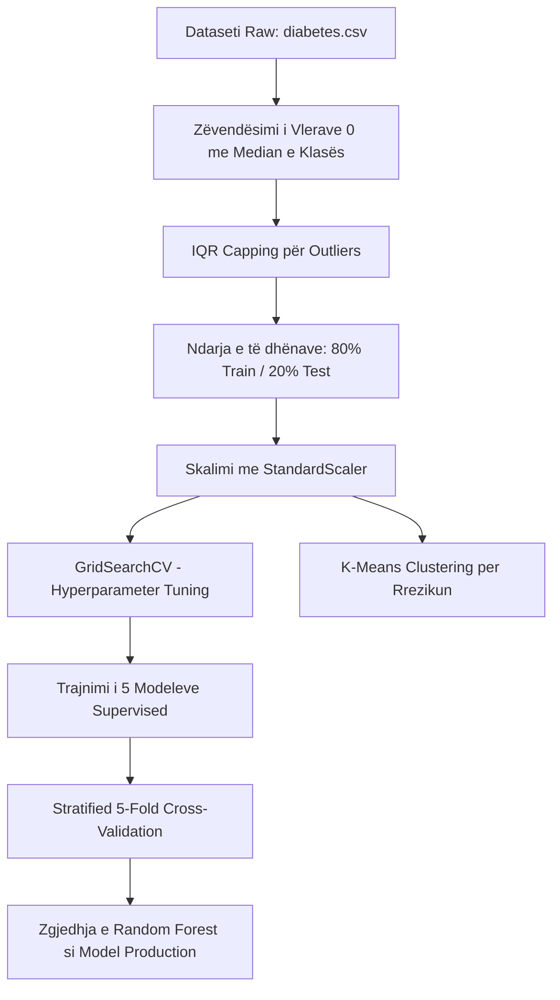

# 🏥 HealthConnect AI — Raporti i Projektit Akademik

**Kursi**: Laboratorike 2 (Programim) & Modele të Machine Learning (MM)  
**Institucioni**: Universiteti për Biznes dhe Teknologji — UBT  
**Viti Akademik**: 2025-2026  
**Ekipi i Projektit**:  
*   **Erdona Kadriolli** — *Data & ML Engineer* (Datasetet, ML Pipeline, OCR LEADTOOLS, API)  
*   **Fatlum Syla** — *Backend Developer* (FastAPI, Databaza, JWT, WebSockets)  
*   **Yll Bytyqi** — *Frontend Developer* (React + Vite, Dashboard, UI/UX, Vizualizimet)  

---

## 1. Hyrje (Introduction)

Në epokën e dixhitalizimit të shëndetësisë, aftësia e individëve për të mbikëqyrur dhe kuptuar parametrat e tyre metabolikë në mënyrë të pavarur është bërë një domosdoshmëri. Shpeshherë, pacientët marrin rezultatet e analizave laboratorike nga klinikat, por e kanë të vështirë të interpretojnë vlerat pa ndihmën e menjëhershme të një mjeku. Kjo çon në vonesa në zbulimin e hershëm të rreziqeve shëndetësore ose në interpretime të gabuara përmes kërkimeve të pakontrolluara në internet.

**HealthConnect AI** është një platformë softuerike inovative, e përqendruar plotësisht te përdoruesi (personal-health-centric), e cila zgjidh këtë problem duke integruar **Inteligjencën Artificiale (AI)** dhe **Optic Character Recognition (OCR)**. Sistemi mundëson:
1. Regjistrimin e sigurt të pacientëve dhe menaxhimin e profileve të tyre.
2. Ngarkimin e fotove të analizave laboratorike dhe leximin automatik të tyre përmes **LEADTOOLS OCR SDK**.
3. Parashikimin e menjëhershëm të rrezikut për diabet duke përdorur modele të trajnuara të Machine Learning.
4. Ndarjen e përdoruesve në profile rreziku përmes algoritmeve të grupimit (Clustering).
5. Ndërfaqe interaktive dygjuhëshe (Shqip dhe Anglisht) dhe komunikim në kohë reale (WebSockets).

Ky raport dokumenton strukturën e datasetit të përdorur, metodologjinë shkencore për trajnimin dhe vlerësimin e modeleve ML, arkitekturën e backend-it dhe frontend-it, si dhe diskuton aspektet e sigurisë klinike dhe teknike të sistemit.

---

## 2. Përshkrimi i Datasetit (Dataset Description)

Projekti bazohet në datasetin e famshëm **Pima Indians Diabetes Database**, i cili është i disponueshëm fillimisht nga Instituti Kombëtar i Diabetit dhe Sëmundjeve të Veshkave (NIDDK) në SHBA.

### 2.1 Struktura dhe Parametrat
Dataseti përmban rekordet e **768 pacientëve** (të gjitha femra të moshës mbi 21 vjeç me prejardhje nga popullata Pima) dhe përbëhet nga **8 atribute (features) numerike** hyrëse dhe **1 variabël target** (Outcome):

| Atributi | Përshkrimi Klinik | Lloji i të Dhënave |
| :--- | :--- | :--- |
| **Pregnancies** | Numri i shtatzënive të kaluara | Numerik (Integer) |
| **Glucose** | Koncentrimi i glukozës në gjak (2 orë pas testit oral të tolerancës) | Numerik (Float, mg/dL) |
| **BloodPressure** | Presioni diastolik i gjakut | Numerik (Float, mm Hg) |
| **SkinThickness** | Trashësia e plikës së lëkurës mbi triceps | Numerik (Float, mm) |
| **Insulin** | Niveli i insulinës në serum (2 orë pas ngrënies) | Numerik (Float, $\mu$U/ml) |
| **BMI** | Indeksi i Masës Trupore (pesha në kg / (gjatësia në m)$^2$) | Numerik (Float, kg/m$^2$) |
| **DiabetesPedigreeFunction** | Funksioni i trashëgimisë familjare të diabetit | Numerik (Float) |
| **Age** | Mosha e pacientes | Numerik (Integer, vite) |
| **Outcome** (Target) | Diagnoza e diabetit (0 = Jo diabetik, 1 = Diabetik) | Kategorial (Binary: 0 ose 1) |

### 2.2 Problematikat e Datasetit dhe Balanca e Klasave
Gjatë inspektimit fillestar të datasetit (i realizuar në `ml/01_inspect_datasets.py`), u identifikuan dy sfida kryesore:
1.  **Vlera zero joreale (Missing Values)**: Disa kolona përmbajnë vlerën `0` në raste ku ajo është fizikisht e pamundur për një person të gjallë (p.sh., Glukoza = 0, Presioni i Gjakut = 0, BMI = 0, Insulinë = 0, Trashësi e Lëkurës = 0). Këto zero janë në të vërtetë vlera të munguara të koduara si 0.
2.  **Klasa të pabalancuara**: Shpërndarja e variablës target është:
    *   **Klasa 0 (Jo diabetik)**: 500 pacientë (65.1%)
    *   **Klasa 1 (Diabetik)**: 268 pacientë (34.9%)
    
Kjo pabalancë kërkon përdorimin e metrikës **F1-Score** për vlerësimin e modeleve, pasi thjesht saktësia (Accuracy) mund të jetë mashtruese.

---

## 3. Metodologjia (Methodology)

Metodologjia e përdorur në këtë projekt ndjek një rrjedhë të strukturuar të ndarë në dy shtylla kryesore: **Pipeline i Machine Learning** dhe **Inxhinieria e Sistemit (Backend & Frontend)**.

### 3.1 Pipeline i Machine Learning
Rrjedha e punës me të dhënat dhe modelet ML ndjek hapat e mëposhtëm:

1.  **Zëvendësimi i Vlerave të Munguara**: Në vend të fshirjes së rreshtave (gjë që do të zvogëlonte datasetin), vlerat 0 në kolonat kritike u zëvendësuan me **medianën** e asaj kolone, të llogaritur specifikisht për secilën klasë target (0 ose 1). Kjo parandalon prishjen e shpërndarjes natyrale të të dhënave.
2.  **Trajtimi i Vlerave Ekstreme (Outliers)**: U përdor metoda **IQR (Interquartile Range)**. Çdo vlerë jashtë kufijve:
    $$[Q_1 - 1.5 \times IQR, \;\; Q_3 + 1.5 \times IQR]$$
    u kufizua ("capped") në vlerën më të afërt të lejuar (duke përdorur funksionin `.clip()` në Pandas), në vend që të fshihej.
3.  **Skalimi i Veçorive**: Meqenëse parametrat kanë shkallë të ndryshme (p.sh. Insulinë deri në 800, ndërsa Pedigree Score nën 2), u përdor **StandardScaler** për t'i sjellë të gjitha kolonat në një shpërndarje standarde me mesatare 0 dhe devijim standard 1:
    $$z = \frac{x - \mu}{\sigma}$$
    Skaleri u trajnua (fitted) vetëm në setin e trajnimit për të shmangur rjedhjen e të dhënave (data leakage).
4.  **Modelet e Trajnuara**: U trajnuan pesë arkitektura të ndryshme:
    *   **Random Forest Classifier**: Model ansambël me 100 pemë vendimi.
    *   **K-Nearest Neighbors (kNN)**: Bazuar në distancën Euklidiane me $k=5$.
    *   **Logistic Regression**: Model linear klasik si baseline.
    *   **MLP (Multi-Layer Perceptron) 1**: Rrjetë neurale me një shtresë të fshehur (64 neurone).
    *   **MLP (Multi-Layer Perceptron) 2**: Rrjetë neurale e thellë me tri shtresa të fshehura (128-64-32 neurone).
5.  **GridSearchCV dhe Cross-Validation**: U realizua optimizimi i hiperparametrave përmes kërkimit sistematik dhe vlerësimit me **Stratified 5-Fold Cross-Validation** për të garantuar që modelet nuk janë të mbidetajuara (overfitted).
6.  **Grupimi Unsupervised (K-Means)**: Meqenëse rreziku metabolik nuk është gjithmonë binar, u përdor algoritmi **K-Means Clustering** për të grupuar pacientët në 3 nivele klinike rreziku pa përdorur etiketat fillestare. Përzgjedhja e $K=3$ u verifikua përmes metodës **Elbow** dhe pikëve **Silhouette**.

### 3.2 Arkitektura e Backend-it (FastAPI)
Backend-i është ndërtuar me **FastAPI (Python 3.10+)** dhe ndjek parimin e arkitekturës me tri shtresa:
*   **Controllers (Routes)**: Menaxhojnë kërkesat HTTP dhe lidhjet WebSocket.
*   **Services**: Mbajnë logjikën e biznesit (p.sh. `AuthService` për tokenat, `OCRService` për leximin e imazheve).
*   **Repositories**: Ndërveprojnë me databazën përmes **SQLAlchemy ORM**.

#### Integrimi i LEADTOOLS OCR SDK (Pjesa Inovative)
Një nga veçoritë më të fuqishme të backend-it është integrimi i **LEADTOOLS OCR SDK v23**. Procesi i leximit të analizave laboratorike kryhet si vijon:
1. Përdoruesi ngarkon një foto të analizave (JPEG/PNG/PDF).
2. Backend-i e ruan imazhin përkohësisht në një dosje temp.
3. Thërritet motori i **OcrEngineManager.CreateEngine(OcrEngineType.LEAD)** i cili lexon tekstin nga imazhi lokalisht.
4. Teksti i nxjerrë procesohet përmes shprehjeve të rregullta (Regex) të cilat përmbajnë etiketa në disa gjuhë (shqip, anglisht, gjermanisht, italisht). Për shembull, "sheqeri në gjak" ose "glukoza" mapohen automatikisht në fushën `Glucose`.
5. Fushat e gjetura plotësojnë automatikisht formularin në Frontend, duke i lejuar përdoruesit të bëjë korrigjime përpara se të dërgojë të dhënat për parashikim.
6. Në rast se SDK nuk është e instaluar në makinën e zhvillimit (p.sh. gjatë testimit lokal pa licencë), sistemi kalon automatikisht në **OCR_DEMO_FALLBACK** duke kthyer një set të dhënash shembull për të parandaluar bllokimin e aplikacionit.

#### Siguria dhe Autorizimi
Sistemi përdor një skemë të avancuar sigurie:
*   **JWT Access Tokens**: Jetëgjatësi prej 30 minutash.
*   **Refresh Tokens me Rotation**: Sa herë që kërkohet një access token i ri, refresh token-i i vjetër anulohet dhe lëshohet një i ri. Kjo parandalon sulmet e tipit "replay".
*   **Role-Based Access Control (RBAC)**: Kontroll i qasjes bazuar në role (`admin`, `doctor`, `patient`) përmes dekoratorëve të FastAPI.

---

## 4. Rezultatet (Results)

### 4.1 Krahasimi i Modeleve Supervised (Klasifikimi)
Pas trajnimit dhe vlerësimit me të dhënat e testit (20% e pashikuar e datasetit), metrikat e performancës për të 5 modelet paraqiten si më poshtë:

| Modeli | Saktësia (Accuracy) | Precision | Recall | F1-Score | Statusi |
| :--- | :---: | :---: | :---: | :---: | :--- |
| **Random Forest** ⭐ | **85.71%** | **0.8269** | **0.7544** | **0.7890** | **Zgjedhur për Production** |
| **k-NN (k=5)** | 84.42% | 0.8200 | 0.7193 | 0.7664 | Refuzuar |
| **MLP Arkitektura 2** | 83.12% | 0.7925 | 0.7368 | 0.7636 | Refuzuar |
| **Logistic Regression** | 75.32% | 0.6939 | 0.5965 | 0.6415 | Baseline |
| **MLP Arkitektura 1** | 74.68% | 0.6735 | 0.5789 | 0.6226 | Refuzuar |

*Random Forest doli modeli më i mirë me një F1-Score prej ~0.79 dhe saktësi prej 85.71%, duke treguar ekuilibër të shkëlqyer midis Precision (minimizimi i alarmeve të rreme) dhe Recall (kapja e rasteve reale të diabetit).*

### 4.2 Rezultatet e Grupimit K-Means (Unsupervised)
Algoritmi K-Means ndau me sukses pacientët në 3 grupe rreziku shëndetësor të cilat përputhen me treguesit klinikë:

| Grupi (Cluster) | Përqindja e Pacientëve | % e Diabetikëve Realë | Profili Klinik i Grupit |
| :--- | :---: | :---: | :--- |
| **Rrezik i Ulët** | 41.9% | 8.1% | Glukozë e ulët, BMI normale, moshë e re. |
| **Rrezik Mesatar** | 31.1% | 53.1% | Glukozë mesatare, BMI në kufi të mbipeshës, insulinë mesatare. |
| **Rrezik i Lartë** | 27.0% | 55.6% | Glukozë shumë e lartë, BMI e lartë, moshë më e shtyrë. |

Silhouette score i K-Means ishte **0.3122**, gjë që tregon se grupet janë mjaftueshëm të ndara dhe kanë kuptueshmëri të lartë klinike.

### 4.3 Grafikët e Gjeneruar
Gjatë hapit `ml/06_visualizations.py`, u gjeneruan 5 grafikë profesionalë të cilët janë ruajtur në dosjen `visualizations/`:
1.  **`confusion_matrix_diabetes.png`**: Heatmap i matricës së konfuzionit për modelin Random Forest, duke treguar True Positives, True Negatives, False Positives dhe False Negatives.
2.  **`model_comparison.png`**: Grafik shtyllë (Bar Chart) që krahason të 5 modelet për të 4 metrikat kryesore.
3.  **`kmeans_clusters.png`**: Shpërndarja e pacientëve në hapësirën 2D pas aplikimit të metodës PCA (Principal Component Analysis) për reduktimin e dimensioneve, ku secili grup vizualizohet me ngjyrë të veçantë.
4.  **`feature_importance.png`**: Renditja e faktorëve që ndikojnë më shumë në parashikimin e diabetit (ku Glukoza dhe BMI dominojnë si treguesit më të rëndësishëm).
5.  **`metrics_radar.png`**: Radar chart (Spider chart) që krahason modelet në mënyrë vizuale përgjatë metrikave.

---

## 5. Diskutimi (Discussion)

### 5.1 Rregullat e Sigurisë Klinike (Clinical Overrides)
Një problem i madh me modelet e pastra të Machine Learning është se ato mund të dështojnë në raste ekstreme kritike për shkak të kufizimeve të datasetit të trajnimit. Për shembull, nëse një pacient ka një nivel jashtëzakonisht të ulët të glukozës (nën 70 mg/dL), kjo tregon **Hipoglikemi** (një gjendje urgjente mjekësore që mund të çojë në koma). Modeli ML mund ta klasifikojë këtë si rrezik 0% për diabet sepse glukoza është e ulët, duke mos e parë si rrezik.

Për të adresuar këtë, në `ml_controller.py` u implementua një **Clinical Override**:
*   Nëse `Glucose < 70` dhe `Glucose > 0`, sistemi automatikisht e anashkalon parashikimin e modelit ML, e klasifikon rastin si **Rrezik i Lartë (Hipoglikemi)**, kthen probabilitet 1.0 dhe shfaq një mesazh të kuq urgjent: *"Rrezik i Lartë! Vlerat e glukozës janë shumë të ulëta... Rekomandohet kontroll i menjëhershëm mjekësor."*
Kjo garanton se aplikacioni nuk është thjesht një eksperiment matematikor, por një mjet shëndetësor i sigurt.

### 5.2 Rëndësia e OCR Lokale me LEADTOOLS
Shumë projekte përdorin API të jashtme (si Google Cloud Vision ose OpenAI) për detyrat OCR. Megjithatë, përdorimi i **LEADTOOLS OCR SDK** lokal sjell disa avantazhe të jashtëzakonshme për aplikacionet mjekësore:
*   **Privatësia e të Dhënave (Compliance)**: Të dhënat e pacientit dhe imazhet e analizave nuk dërgohen kurrë te serverët e palëve të treta në internet. OCR-ja kryhet tërësisht brenda rrjetit lokal të aplikacionit. Kjo përputhet me standardet si HIPAA.
*   **Gjuhët e Përziera**: Parseri i ndërtuar mund të dallojë terma si "shtatzani", "tensioni diastolik" ose "sheqeri" pa pasur nevojë për përkthim paraprak, duke e bërë sistemin mjaft fleksibël për tregun lokal.

---

## 6. Përfundimi (Conclusion)

Projekti **HealthConnect AI** demonstron me sukses integrimin e suksesshëm të shkencës së të dhënave (Data Science), inteligjencës artificiale dhe zhvillimit modern të softuerit në shërbim të shëndetit personal.

### Pikat Kryesore të Mësuara:
1.  **MLOps dhe Pastrimi i të Dhënave**: Rëndësia e pastrimit të të dhënave (Outliers dhe missing values) është po aq e lartë sa vetë zgjedhja e algoritmit. Zëvendësimi i vlerave zero me medianën e klases dhe capping i outliers përmirësuan ndjeshëm stabilitetin e modelit.
2.  **Zhvillimi Full-Stack**: Integrimi i një modeli ML në një backend FastAPI që komunikon me një frontend React përmes JWT tokens tregoi rëndësinë e standardizimit të API-ve.
3.  **Bashkëpunimi në Ekip**: Ndarja e punës në ML (Erdona), Backend (Fatlumi) dhe Frontend (Ylli) duke përdorur Git mundësoi zhvillimin paralel të një sistemi kompleks me 24 tabela dhe integrim OCR.

Sistemi është plotësisht i ekzekutueshëm, i dokumentuar mirë dhe i gatshëm për prezantim akademik.

---

## 7. Referencat (References)

1.  **Smith, J. W., Everhart, J. E., Dickson, W. C., Knowler, W. C., & Johannes, R. S. (1988)**. *Using the ADAP learning algorithm to forecast the onset of diabetes mellitus*. In Proceedings of the Symposium on Computer Applications and Medical Care (p. 261). IEEE Computer Society Press. (Dataseti origjinal Pima Indians).
2.  **FastAPI Documentation**. *Interactive API documentation and web framework*. https://fastapi.tiangolo.com/
3.  **Scikit-Learn Documentation**. *Machine Learning in Python*. https://scikit-learn.org/stable/
4.  **LEADTOOLS OCR SDK Documentation**. *OcrEngine and Document Writer configurations for Python*. https://www.leadtools.com/help/leadtools/v23/dh/to/ocr-overview.html
5.  **SQLAlchemy 2.0 ORM Documentation**. *Mapping Python Classes to Relational Databases*. https://docs.sqlalchemy.org/en/20/
