# 📊 Diagrami i Databazës dhe Dokumentimi i ERD-së

Ky dokument përmban përshkrimin e detajuar të strukturës finale të databazës për projektin **HealthConnect AI**, i cili përbëhet nga gjithsej **24 tabela**. Për menaxhim më të lehtë, tabelat ndahen në dy grupe kryesore:
1. **Tabelat e Sistemit (10 tabela)**: Menaxhojnë përdoruesit, rolet, autorizimin, sigurinë dhe konfigurimet.
2. **Tabelat Mjekësore (14 tabela)**: Mbajnë të dhënat shëndetësore, historikun klinik të pacientëve, vizitat, dhe parashikimet e Inteligjencës Artificiale.

---

## 🗺️ Diagrami ERD (Entity-Relationship Diagram)

Më poshtë paraqitet diagrami interaktiv i relacioneve të databazës i shkruar në **Mermaid**:

```mermaid
erDiagram
    %% Tabelat e Sistemit
    users ||--o{ user_roles : "ka"
    roles ||--o{ user_roles : "ka"
    roles ||--o{ role_permissions : "ka"
    permissions ||--o{ role_permissions : "ka"
    users ||--o{ refresh_tokens : "gjeneron"
    users ||--o{ audit_logs : "shkakton"
    users ||--o{ notifications : "merr"
    users ||--o{ files : "ngarkon"

    %% Tabelat Mjekesore
    users ||--o| patients : "eshte"
    users ||--o| doctors : "eshte"
    doctors ||--o{ specializations : "ka"
    patients ||--o{ appointments : "rezervon"
    doctors ||--o{ appointments : "pranon"
    patients ||--o{ medical_records : "ka"
    doctors ||--o{ medical_records : "shkruan"
    patients ||--o{ lab_tests : "kryen"
    doctors ||--o{ lab_tests : "kerkon"
    patients ||--o{ prescriptions : "merr"
    doctors ||--o{ prescriptions : "shkruan"
    prescriptions ||--o{ medications : "permban"
    patients ||--o{ symptom_reports : "raporton"
    symptoms ||--o{ symptom_reports : "klasifikohet"
    patients ||--o{ vaccinations : "kryen"
    patients ||--o{ emergency_contacts : "ka"
    patients ||--o{ insurance_policies : "ka"

    users {
        int id PK
        string first_name
        string last_name
        string email UK
        string password_hash
        boolean is_active
        datetime created_at
        datetime updated_at
        int created_by
    }

    roles {
        int id PK
        string name UK
        string description
        datetime created_at
        datetime updated_at
        int created_by
    }

    user_roles {
        int id PK
        int user_id FK
        int role_id FK
        datetime assigned_at
        datetime updated_at
        int created_by
    }

    permissions {
        int id PK
        string name UK
        string description
        datetime created_at
        datetime updated_at
        int created_by
    }

    role_permissions {
        int id PK
        int role_id FK
        int permission_id FK
        datetime created_at
        datetime updated_at
        int created_by
    }

    refresh_tokens {
        int id PK
        int user_id FK
        string token_hash
        datetime expires_at
        boolean revoked
        datetime created_at
        datetime updated_at
        int created_by
    }

    audit_logs {
        int id PK
        int user_id FK
        string action
        string entity
        int entity_id
        json old_value
        json new_value
        string ip_address
        datetime created_at
    }

    notifications {
        int id PK
        int user_id FK
        string type
        string title
        string message
        boolean is_read
        datetime created_at
    }

    settings {
        int id PK
        string key UK
        string value
        string description
        datetime updated_at
    }

    files {
        int id PK
        string entity
        int entity_id
        string filename
        string file_path
        int file_size
        int uploaded_by FK
        datetime created_at
    }

    patients {
        int id PK
        int user_id FK
        datetime dob
        string gender
        string blood_type
        datetime created_at
        datetime updated_at
    }

    doctors {
        int id PK
        int user_id FK
        string license_number UK
        int years_experience
        datetime created_at
        datetime updated_at
    }

    appointments {
        int id PK
        int patient_id FK
        int doctor_id FK
        datetime scheduled_at
        string status
        datetime created_at
        datetime updated_at
    }

    specializations {
        int id PK
        int doctor_id FK
        string name
        datetime created_at
        datetime updated_at
    }

    medical_records {
        int id PK
        int patient_id FK
        int doctor_id FK
        string diagnosis
        string treatment_plan
        datetime created_at
        datetime updated_at
    }

    lab_tests {
        int id PK
        int patient_id FK
        int doctor_id FK
        int pregnancies
        float glucose
        float blood_pressure
        float skin_thickness
        float insulin
        float bmi
        float diabetes_pedigree_function
        int age
        int ml_prediction
        float ml_confidence
        datetime created_at
        datetime updated_at
    }

    prescriptions {
        int id PK
        int patient_id FK
        int doctor_id FK
        string note
        datetime created_at
        datetime updated_at
    }

    medications {
        int id PK
        int prescription_id FK
        string name
        string dosage
        datetime created_at
        datetime updated_at
    }

    symptoms {
        int id PK
        string name UK
        string description
        datetime created_at
        datetime updated_at
    }

    symptom_reports {
        int id PK
        int patient_id FK
        int symptom_id FK
        int severity
        string notes
        datetime created_at
        datetime updated_at
    }

    clinics {
        int id PK
        string name
        string address
        datetime created_at
        datetime updated_at
    }

    vaccinations {
        int id PK
        int patient_id FK
        string vaccine_name
        datetime administered_on
        datetime created_at
        datetime updated_at
    }

    emergency_contacts {
        int id PK
        int patient_id FK
        string full_name
        string phone
        string relationship
        datetime created_at
        datetime updated_at
    }

    insurance_policies {
        int id PK
        int patient_id FK
        string provider
        string policy_number UK
        datetime expiry_date
        datetime created_at
        datetime updated_at
    }
```

---

## 🗄️ Përshkrimi i Tabelave të Sistemit (System Tables)

Këto **10 tabela** shërbejnë për menaxhimin e infrastrukturës kryesore të aplikacionit, sigurinë dhe ndjekjen e auditimit:

1. **`users`**: Ruaj të dhënat e llogarisë së përdoruesve (pacientë, mjekë ose administratorë). Fjalëkalimi ruhet në formë të hash-uar me `bcrypt`.
2. **`roles`**: Ruan rolet e sistemit (`admin`, `doctor`, `patient`).
3. **`user_roles`**: Lidhë përdoruesit me rolet e tyre (mbështet marrëdhënie many-to-many, megjithëse zakonisht ka një rol).
4. **`permissions`**: Përcakton privilegje specifike të sistemit (p.sh. `manage_users`, `view_medical_records`, `run_predictions`).
5. **`role_permissions`**: Lidhë rolet me privilegjet e lejuara (tabela e ndërmjetme many-to-many).
6. **`refresh_tokens`**: Përdoret për mekanizmin e rifreskimit të JWT Token (Refresh Token Rotation). Kjo parandalon seancat e pakufizuara dhe rrit sigurinë.
7. **`audit_logs`**: Ruan çdo ndryshim që ndodh në sistem. Regjistron kush e bëri ndryshimin, adresën IP, aksionin e kryer, si dhe vlerat e vjetra e të reja në format JSON.
8. **`notifications`**: Përdoret për dërgimin e njoftimeve live te përdoruesit përmes WebSockets dhe për ruajtjen e tyre në arkivë.
9. **`settings`**: Tabela e konfigurimeve globale të sistemit në format çelës-vlerë (key-value).
10. **`files`**: Ndjek skedarët e ngarkuar në sistem (p.sh. fotot e analizave të ngarkuara nga pacientët).

---

## 🏥 Përshkrimi i Tabelave Mjekësore (Medical Tables)

Këto **14 tabela** shërbejnë për të modeluar skenarin klinik të sistemit dhe ruajtjen e historikut mjekësor të pacientëve:

11. **`patients`**: Profil i detajuar i pacientit që lidhet 1-to-1 me tabelën `users`. Ruan ditëlindjen, gjininë dhe grupin e gjakut.
12. **`doctors`**: Profil i detajuar i mjekut që lidhet 1-to-1 me tabelën `users`. Ruan numrin e licencës dhe vitet e përvojës.
13. **`specializations`**: Ruan fushat e specializimit të mjekëve (p.sh. Endokrinologji, Kardiologji).
14. **`appointments`**: Menaxhon takimet/vizitat e planifikuara mes pacientëve dhe mjekëve, duke përfshirë statusin e tyre.
15. **`medical_records`**: Ruan diagnozat e përgjithshme dhe planet e trajtimit të lëshuara nga mjekët për pacientët.
16. **`lab_tests`**: **Tabela kyçe e projektit**. Ruan të gjitha vlerat metabolike të analizave të gjakut të futura manualisht ose të lexuara nga OCR, si dhe rezultatet e parashikimit të modelit ML (`ml_prediction` si 0 ose 1) dhe përqindjen e besueshmërisë (`ml_confidence`).
17. **`prescriptions`**: Recetat e lëshuara nga mjekët për pacientët.
18. **`medications`**: Ruan barnat/medikamentet specifike të përshkruara në një recetë së bashku me dozën e tyre.
19. **`symptoms`**: Regjistri i simptomave të mundshme klinike.
20. **`symptom_reports`**: Raportimet e simptomave nga vetë pacientët, duke përcaktuar shkallën e severitetit (nga 1 në 10).
21. **`clinics`**: Menaxhon të dhënat e klinikave të lidhura me sistemin.
22. **`vaccinations`**: Regjistron vaksinat e marra nga pacienti dhe datën e administrimit.
23. **`emergency_contacts`**: Kontaktoni emergjent për çdo pacient (emri, telefoni, relacioni).
24. **`insurance_policies`**: Politikat e sigurimit shëndetësor të pacientit (provajderi, numri i polisës, data e skadimit).

---

## 🔒 Integriteti dhe Referencat e Databazës

* **Fshirja në Kaskadë (ON DELETE CASCADE)**: Për tabelat e ndërmjetme dhe profilet sekondare (si `user_roles`, `patients`, `doctors`, `refresh_tokens`), fshirja e rekordit prind (p.sh. fshirja e një përdoruesi nga tabela `users`) automatikisht pastron të gjitha rekordet e lidhura.
* **Mbrojtja e të dhënave (ON DELETE SET NULL)**: Për regjistrat historikë kritikë (si `audit_logs` dhe `files`), fshirja e përdoruesit nuk i fshin të dhënat e auditimit apo skedarët, por vendos vlerën e referencës si `NULL` për të ruajtur integritetin e historikut të sistemit.
* **Indeksimi (Indexing)**: Fushat që kërkohen më shpesh (si `email` te `users`, `user_id` te tabelat e njoftimeve dhe refresh_tokens) kanë indekse të krijuara për të optimizuar shpejtësinë e kërkimit (query-ve) në nivele të mëdha të dhënash.
